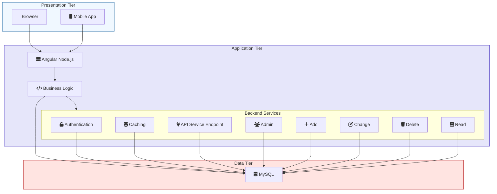

# mermaid-test
Mermaid Diagram Test

```mermaid

flowchart TD
  subgraph Presentation_Tier["Presentation Tier"]
    A["fa:fa-browser Browser"]
    B["fa:fa-mobile Mobile App"]
  end

  subgraph Backend_Services["Backend Services"]
    S1["fa:fa-unlock Authentication"]
    S2["fa:fa-database Caching"]
    S3["fa:fa-plug API Service Endpoint<br>"]
    S4["fa:fa-users Admin"]
    S5["fa:fa-plus Add"]
    S6["fa:fa-edit Change"]
    S7["fa:fa-trash Delete"]
    S8["fa:fa-book Read"]
  end

  subgraph Application_Tier["Application Tier"]
    C["fa:fa-server Angular Node.js<br>"]
    D["fa:fa-code Business Logic"]
    Backend_Services
  end

  subgraph Data_Tier["Data Tier"]
    E["fa:fa-database MySQL<br>"]
  end

  A --> C
  B --> C
  C --> D
  D --> E & Backend_Services
  S1 --> E
  S2 --> E
  S3 --> E
  S4 --> E
  S5 --> E
  S6 --> E
  S7 --> E
  S8 --> E

  style Presentation_Tier fill:#f0f8ff, stroke:#4682b4, stroke-width:2px
  style Application_Tier fill:#e6e6fa, stroke:#6a5acd, stroke-width:2px
  style Data_Tier fill:#ffe4e1, stroke:#cd5c5c, stroke-width:2px

```

